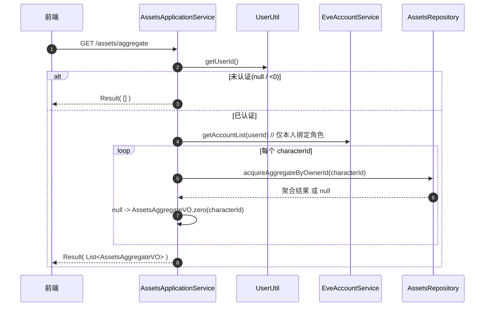

# 资产多角色聚合流程

> 面向开发者：理清「当前用户绑定角色 -> 逐角色聚合资产概况 -> 单次返回分角色件数/价值/类目数」的完整链路。
> 关联代码集中在 `interfaces/web/controller/AssetsController.java`、`application/service/AssetsApplicationService.java`、`domain/service/system/AssetsService.java`、`domain/repository/system/AssetsRepository.java`、`src/main/resources/mappers/system/AssetsMapper.xml`。

## 1. 总览

前端「资产总览」页在单次请求内枚举当前登录用户绑定的全部角色，为每个角色返回一段资产概况：**物品总件数（quantity 求和）、资产总价值（quantity × base_price 求和）、类目数（去重 type_id 数）**。

核心安全设计：本端点**不做** `accessGuard.requireOwnership(cid)` —— 因为它根本没有接收用户可控的 `cid` 入参，而是通过 `getAccountList(userId)` **天然枚举本人绑定角色**。越权角色根本不会被枚举出来，因此无从查询。

```
GET /assets/aggregate
  -> AssetsController.getAssetsAggregate
  -> AssetsApplicationService.aggregateAssetsByUser
       -> UserUtil.getUserId()                        // 未认证返回 -1 -> 直接空列表
       -> EveAccountService.getAccountList(userId)    // 仅本人绑定角色(安全边界)
       -> 逐角色 AssetsService.getAggregateByOwnerId(characterId)
            -> AssetsRepository.acquireAggregateByOwnerId(ownerId)
                 -> AssetsMapper.selectAggregateByOwnerId(SQL: assets LEFT JOIN inv_types ... GROUP BY owner_id)
       -> 无资产角色 AssetsAggregateVO.zero(characterId)
  <- Result< List<AssetsAggregateVO> >
```

**重要事实（与同源其它端点的差异）**：`assets/{cid}/sync` 与 `GET /assets/{cid}` 都走 `accessGuard.requireOwnership(cid)` 防 IDOR；唯独 `/assets/aggregate` 无路径参数、靠 `getAccountList(userId)` 限定枚举范围。新增任何「按角色聚合」端点时勿照抄此模式而引入可注入的 ownerId。

## 2. 数据模型（MySQL，eve 数据源）

聚合 SQL 在 `AssetsMapper.xml#selectAggregateByOwnerId`：

```sql
select ass.owner_id                                        as ownerId,
       SUM(ass.quantity)                                   as assetCount,
       SUM(ass.quantity * COALESCE(it.base_price, 0))      as assetValue,
       COUNT(DISTINCT ass.type_id)                         as categoryCount
from assets ass
       left join inv_types it on ass.type_id = it.type_id
where ass.owner_id = #{ownerId,jdbcType=INTEGER}
group by ass.owner_id
```

- **同库 join 静态库**：`assets`（运行时数据，eve_helper 数据源）`LEFT JOIN inv_types`（游戏静态数据），二者在同一 `eve_helper` 数据源下——与 `AssetsMapper.xml#selectAssertsInvtypeUniverse` 的既有左右 join 一致，单条 SQL 即可完成，故相对基础价格 `base_price` 可从 `inv_types` 联出。
- **值口径**：`assetValue = SUM(quantity * COALESCE(base_price, 0))`。`COALESCE` 把 `inv_types.base_price` 为 NULL（静态库缺价）时兜底为 0，避免整条聚合被 NULL 污染成 null。
- **类目数**：`COUNT(DISTINCT type_id)` 为同一种物品（即便分行存放）只计 1。
- **无资产 owner 无聚合行**：`where owner_id=#{ownerId}` 命中 0 行时 `GROUP BY` 不产出行，`resultType=AssetsAggregatePO` 映射返回 **null**（下游见 §4 转为零值视图）。

> ⚠️ **`AssetsAggregatePO` 是查询投影（非表实体）**：不参与 BaseMapper CRUD，仅由本条聚合 SQL 的 `resultType` 直接映射承载。新增字段需同时改 SQL 别名与此 PO。

## 3. 聚合读模型（AssetsAggregateVO）

`domain/model/vo/AssetsAggregateVO.java` 是**不可变 record**，跨层共享的查询结果载体：

```java
public record AssetsAggregateVO(Integer ownerId, Long assetCount, Double assetValue, Long categoryCount) {
    public static AssetsAggregateVO zero(Integer ownerId) {
        return new AssetsAggregateVO(ownerId, 0L, 0.0, 0L);
    }
}
```

`zero(ownerId)` 为「尚未同步资产」的角色提供**零值视图**（0 件 / 0 价值 / 0 类目），使前端能显示「已绑定但无数据」的角色，而不是报错。

## 4. 逐角色聚合流程

`AssetsApplicationService.aggregateAssetsByUser()`：

1. `userId = UserUtil.getUserId()`：**未认证返回 -1**（见 [login-lifecycle.md](./login-lifecycle.md) §安全上下文）。此处 `userId == null || userId < 0` 时直接返回空列表——不抛 401，走「空数据」语义。
2. `accounts = eveAccountService.getAccountList(userId)`：仅取 userId 绑定的角色；为空返回空列表。
3. `accounts.stream()` 逐角色取 `characterId`（`filter(Objects::nonNull)`），对每个角色调 `assetsService.getAggregateByOwnerId(characterId)`。
4. 返回 **null**（该角色无资产）时改为 `AssetsAggregateVO.zero(characterId)`；否则直接透传。
5. `getAggregateByOwnerId` 沿 `AssetsService -> AssetsRepository.acquireAggregateByOwnerId -> AssetsMapper.selectAggregateByOwnerId` 落到 SQL。

### 4.1 时序图



**注意（顺序串行）**：逐角色聚合是 `stream().map()` 串行执行的，每个角色独立一条 `SELECT ... GROUP BY`。角色较多时本接口对 DB 发起 N 次分组查询——当前数据量下可接受；膨胀时可评估单条「一次枚举全部 owner」的 `WHERE owner_id IN (...)` 聚合 SQL。

## 5. 前置依赖与坑（重要）

| 要点 | 说明 |
|------|------|
| **T001 资产 ownerId 回填** | 聚合按 `owner_id` 归类。资产同步时必须把 owner 归因到所属角色，否则 `owner_id=NULL`，本 SQL 聚合恒为空、归属鉴权与 stale 删除一并失效。见 §6 —— 本特性已修复 |
| **越权面** | 无 ownerId 入参，枚举范围由 `getAccountList(userId)` 锁定；即便持有他人角色 ID 也无法注入查询 |
| **未认证语义** | 返回**空列表**而非 401（`UserUtil` -1 短路）。与需鉴权端点的 401 语义不同 |
| **无资产角色** | `zero(ownerId)` 零值视图，不报错、不丢角色 |
| **COALESCE 兜底** | `base_price` 为 NULL 时价值按 0 参与聚合，防整行被 NULL 污染 |
| **DB 依赖** | `inv_types` 表必须存在且有 `base_price` 列（eve 数据源）；跨库迁移时勿拆成远程调用 |

## 6. 资产同步与 ownerId 归因（上下文）

聚合正确性依赖 §5 的第一个前置。资产同步 `AssetsService.saveAndUpdateAsserts(cid)` 中，从 ESI 取回的资产列表需把每个 item 归因到同步角色：

```java
// EsiAssetsConverter 将 owner_id 置为 ignore，需在此回填，否则聚合/鉴权/stale 删除均失效
Long ownerId = eveAccount.getCharacterId() == null ? null : eveAccount.getCharacterId().longValue();
assets.forEach(a -> a.setOwnerId(ownerId));
batchInsertOrUpdate(assets);
```

同步是幂等 upsert 且同步删除不在 ESI 列表的 `item_id`（`batchInsertOrUpdate` + `removeBatchByIds`），保证聚合口径贴近 ESI 实时持有。

## 7. 关键代码文件索引

| 环节 | 文件 |
|------|------|
| 控制器 | `interfaces/web/controller/AssetsController.java`（`GET /assets/aggregate`） |
| 应用服务 | `application/service/AssetsApplicationService.java`（`aggregateAssetsByUser`） |
| 领域服务 | `domain/service/system/AssetsService.java`（`getAggregateByOwnerId`） |
| 仓储接口/实现 | `domain/repository/system/AssetsRepository.java`、`infrastructure/persistence/repository/system/AssetsRepositoryImpl.java` |
| 聚合 SQL | `src/main/resources/mappers/system/AssetsMapper.xml#selectAggregateByOwnerId` |
| 聚合投影 | `infrastructure/persistence/entity/system/AssetsAggregatePO.java` |
| 聚合读模型 | `domain/model/vo/AssetsAggregateVO.java` |
| 当前用户 ID | `domain/util/UserUtil.java` |
| 绑定角色枚举 | `domain/service/system/EveAccountService.java`（`getAccountList`） |