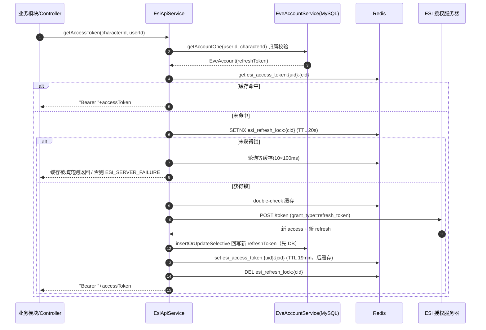

# ESI 授权绑定全生命周期流程

> 面向开发者：理清 EVE 角色从「OAuth 授权 -> 绑定入库 -> accessToken 获取/刷新 -> 授权状态判定 -> 失效重授权」的完整链路。
> 关联代码集中在 `infrastructure/external/esi/`、`application/service/CharacterApplicationService.java`、`domain/service/system/EveAccountService.java`、`interfaces/web/controller/CharacterController.java`。

## 1. 总览

本模块管理**第二套凭证体系**（EVE 官方 access/refresh token），与登录凭证（项目自有 JWT）相互独立，详见 [login-lifecycle.md](./login-lifecycle.md) §1 对照表。

- 协议：OAuth2 Authorization Code（`AuthorizeOAuth`）
- 服务器：晨曦 Serenity（`login.evepc.163.com`，网易代理），ESI 数据源 `ali-esi.evepc.163.com`
- 存储：ESI refresh token 存 MySQL `eve_account`；access token 缓存 Redis 19 分钟
- 核心约束：**ESI refresh token 一次性使用**（每次使用必须回写新值），因此所有刷新路径必须串行化

```
前端                eve-helper                        ESI 授权服务器              MySQL/Redis
 │ authorizeUrl(前端拼接) │                                │                        │
 │ ────────────────────▶ │ (跳转 ESI 登录页)               │                        │
 │ ◀──────────────────── │ code (回调携带)                 │                        │
 │ POST /character/{code}│                                │                        │
 │ ────────────────────▶ │ POST /token (authorization_code)│                        │
 │                       │ ─────────────────────────────▶ │                        │
 │                       │ ◀──── access + refresh token ── │                        │
 │                       │ 解析 characterId / 拉取角色信息  │                        │
 │                       │ ─────────────────────────────────────────────────────▶ │ 存 eve_account
 │                       │                                │         缓存 access(19min)
```

> ⚠️ **`AuthorizeOAuth.authorizeUrl` 主代码中无调用方** -- 授权 URL 目前由前端自行拼接（或待接线）。绑定 code 的服务端入口已存在（`POST /character/{code}`）。**`code_challenge` 有意留空**：晨曦 OAuth 兼容性要求，启用 PKCE 会被授权服务器拒绝，勿当 bug「修复」。

## 2. 绑定入口（授权码换取 token）

- **端点**：`POST /character/{code}`（`CharacterController.addCharacterAuth`，需登录）
- **编排**：`CharacterApplicationService.authorizeCharacter(code, UserUtil.getUserId())` -> `EsiApiService.authorize(code, userId)`（经 `EsiGateway` 端口，domain 层不依赖实现）

`EsiApiService.authorize`：

1. `AuthorizeOAuth.updateAccessToken(GrantType.AUTHORIZATION_CODE, code)` -> POST ESI `/token`（`grant_type=authorization_code&code=...&client_id=...`）。
2. 返回空 token -> `EsiException(ESI_SERVER_FAILURE)`。
3. `updateRefreshToken(authToken, userId)` 完成入库（见下节）。

> **错误处理（006 FR-020）**：ESI 4xx/5xx 的原始错误文本只进服务端日志，对外统一 `ESI_AUTHORIZATION_FAILURE` / `ESI_SERVER_FAILURE` -- 既不泄露 ESI 内部细节，也使「本人角色但 token 已废」与「归属校验失败」不可区分（防枚举）。

## 3. 入库（updateRefreshToken）

`EsiApiService.updateRefreshToken(authToken, userId)`：

1. 解析 ESI access token（JWT）：`sub` claim 格式 `CHARACTER:EVE:{characterId}`，取 `split(":")[2]` 为 characterId；`name` claim 为角色名。
2. 调 `CharacterApi.queryCharacter`（+ `UniverseApi.queryUniverseNames` 解析军团/联盟名）。**每次调用带 5s 超时**（宪法：外部调用 5s 超时）--这两次调用处于刷新锁临界区内，无超时会使临界区无界延长，锁 TTL 过期后轮换竞态重现。
3. 缓存 access token：`esi_access_token:{userId}:{characterId}`（TTL 19min，略短于 ESI 20min 有效期）。
4. 组装 `EveAccount`（characterId/name/corpId/corpName/allianceId/allianceName/refreshToken/userId）-> `eveAccountService.insertOrUpdate`。

`eve_account` 关键字段：`character_id`（角色 ID）、`refresh_token`（**每角色一份**）、`user_id`（归属用户）、`type`（CH:0 EU:1）、`qq`（机器人通道）。

> ⚠️ **refresh token 实际为明文入库**：`EveAccountService.insertOrUpdate` 无任何加密。CLAUDE.md 中「ESI tokens 加密存储在数据库」的描述与当前实现不符 -- 以代码为准；若需加密属行为变更，须走特性轨。

## 4. accessToken 获取与刷新（doGetAccessToken）

- **端点**：`GET /character/{characterId}/access-token`（调试用，`@ConditionalOnProperty` 默认不注册）+ 各业务模块内部调用。
- **统一实现**：`EsiApiService.doGetAccessToken(characterId, userId)`（`getAccessToken` / `getAccessTokenWithExpiry` 均委托于此）：

1. **归属校验前置**：`eveAccountService.getAccountOne(userId, characterId)` 精确匹配（不接受军团维度放行）；失败统一转 `ESI_AUTHORIZATION_FAILURE`，不暴露 `USER_ACCOUNT_NOT_EXIST` 存在性 oracle。用传入 userId（来自 `eveAccount.getUserId()`），不依赖 SecurityContext -- HTTP 路径与内部路径（定时任务无安全上下文）统一适用。
2. **缓存命中**：读 `esi_access_token:{userId}:{characterId}`，命中直接返回（含剩余秒数）。
3. **刷新锁**：`setIfAbsent esi_refresh_lock:{characterId}`（TTL 20s，覆盖临界区最坏耗时 = 刷新 5s + 两次 ESI 调用各 5s + DB 回写）。
   - **锁键按 characterId 而非 (userId, characterId)**：refresh token 是"每角色一份"的资源，且 `doGetAccessToken` 与 `getAuthorizationStatus` 必须互斥。
   - **fail-closed**：`!Boolean.TRUE.equals(acquired)` -- Redis 异常返回 null 视为未持锁，勿写成 `Boolean.FALSE.equals`。
4. **争用等待**：有界轮询 `awaitCachedToken`（10 次 × 100ms ≈ 1s）等持锁方填充缓存；等待窗口内拿到则直接用，超时才报 `ESI_SERVER_FAILURE`。
5. **double-check**：等锁期间缓存可能已被填充，再读一次。
6. **刷新**：`updateAccessToken(GrantType.REFRESH_TOKEN, refreshToken)` 换新 token 对。
7. **回写**（`persistRefreshedToken`）：**先持久化新 refresh token 再缓存 access token** -- DB 写失败时不缓存无对应 refresh token 的 access（否则 19min 内下次刷新必失败）。仅 `insertOrUpdateSelective` 更新 `refresh_token` 列，避免覆盖其他字段。
8. **finally 释放锁**（owner 比对防误删他人锁）。

**userId 为 null 拒绝写缓存**（评审 H3 纵深防御）：否则键退化为 `esi_access_token:null:{cid}`，多用户共享同一键构成跨用户 token 泄露。

### 4.1 刷新时序图



## 5. 授权状态判定（getAuthorizationStatus）

用于用户角色列表展示授权状态（`GET /user/{userId}` 的 `queryAccountListWithAuthStatus`，并行判定经 `esiAuthStatusExecutor`）：

1. 读缓存 `esi_auth_status:{...}`：AUTHORIZED/EXPIRED（TTL 5min）、UNKNOWN（TTL 30s，短 TTL 便于 ESI 恢复后尽快重试）。缓存值非法返回 null 触发重新判定。
2. 缓存未命中 -> `determineAuthStatus(account)`：**尝试 refresh token 换 access**。
   - 成功 -> `persistRefreshedToken`（顺带完成一次真实刷新）-> `AUTHORIZED`
   - `ESI_AUTHORIZATION_FAILURE`(4xx) -> `EXPIRED`（需重新授权）
   - 其余（5xx/网络/超时）-> `UNKNOWN`
   - 任何异常兜底为 UNKNOWN 且不外传，保证单角色异常不影响其他角色判定。
3. 与 `doGetAccessToken` **共用 `esi_refresh_lock:{characterId}`** -- 状态判定本身也消耗一次性 refresh token，两条路径必须互斥。

## 6. 数据与存储模型

| 存储 | 键/表 | 值 | TTL | 说明 |
|------|-------|----|-----|------|
| MySQL | `eve_account` | 角色 + refreshToken + userId | - | refresh token **明文**，每角色一份 |
| Redis | `esi_access_token:{userId}:{characterId}` | `"Bearer "+accessToken` | 19min | 键含 userId+characterId 双隔离 |
| Redis | `esi_refresh_lock:{characterId}` | lock owner | 20s | 所有刷新路径互斥（per 角色） |
| Redis | `esi_auth_status:{...}` | 状态枚举名 | 5min / 30s(UNKNOWN) | 授权状态判定缓存 |

## 7. 关键代码文件索引

| 环节 | 文件 |
|------|------|
| OAuth 客户端（授权 URL / token 端点） | `infrastructure/external/esi/auth/AuthorizeOAuth.java`、`GrantType.java` |
| ESI 客户端配置（晨曦域名/回调/数据源） | `infrastructure/external/esi/EsiClientProperties.java` |
| 绑定入口 | `interfaces/web/controller/CharacterController.java` |
| accessToken 查询端点（调试） | `interfaces/web/controller/CharacterAccessTokenController.java` |
| 应用编排 | `application/service/CharacterApplicationService.java` |
| 核心实现（token 换取/刷新/锁/状态） | `infrastructure/external/esi/EsiApiService.java` |
| 领域端口 | `domain/port/esi/EsiGateway.java` |
| 角色账户实体/服务 | `domain/model/entity/system/EveAccount.java`、`domain/service/system/EveAccountService.java` |
| 权限工具（归属校验） | `domain/util/AuthorizeUtil.java` |
| token 响应模型 | `infrastructure/external/esi/model/AuthTokenResponse.java` |
