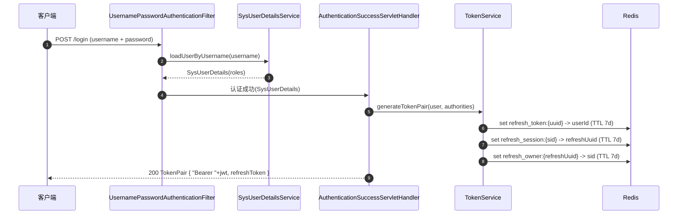
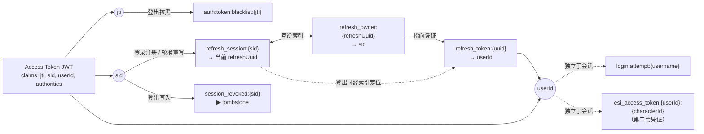
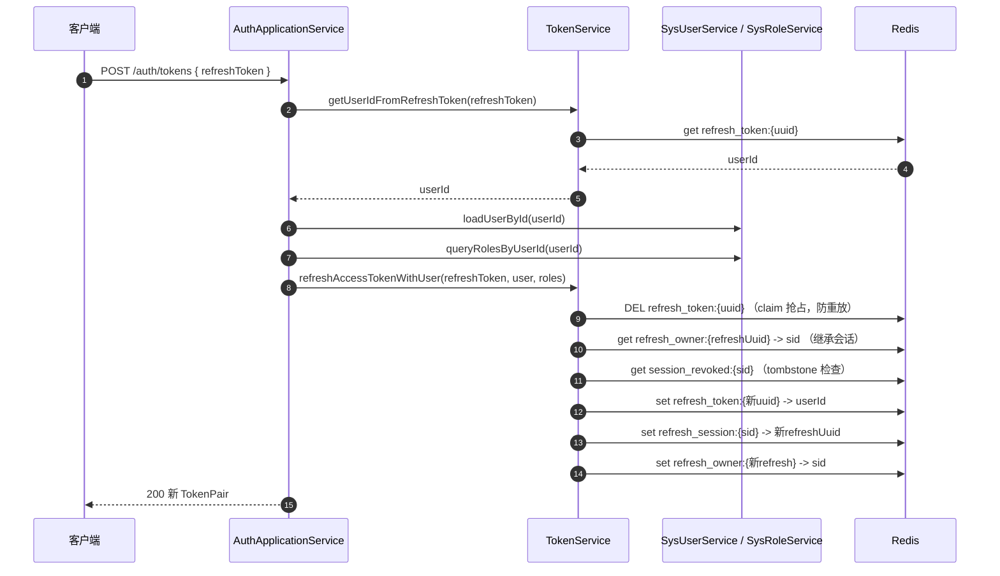
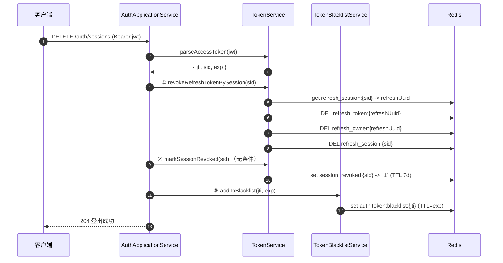

# 用户登录全生命周期流程

> 面向开发者：理清 EVE Helper 从「注册 → 登录 → 请求认证 → 刷新 → 登出」的完整链路。
> 关联代码集中在 `infrastructure/config/security/`、`domain/service/security/`、`application/service/*Auth*`、`infrastructure/external/esi/auth/`。

## 1. 总览

本项目采用 **JWT 无状态认证**（Spring Security + Nimbus JOSE），配合 Redis 做凭据存储与撤销。登录主体是**账号密码表单登录**；此外还有一条**角色 ESI 授权绑定**通道（OAuth2 Authorization Code），用于把 EVE 角色绑定到已登录用户，供后续拉取 ESI 数据。

```
┌─────────────┐   POST /login   ┌──────────────────────────────────────────┐
│   客户端     │ ──────────────▶ │  UsernamePasswordAuthenticationFilter    │
└─────────────┘                 └──────────────┬───────────────────────────┘
                                               │ 成功/失败
                     ┌─────────────────────────▼─────────────────────────┐
                     │ SysUserDetailsService.loadUserByUsername + BCrypt  │
                     └─────────────────────────┬─────────────────────────┘
                                               │
                    ┌──────────────────────────▼──────────────────────────┐
                    │  success → AuthenticationSuccessServletHandler      │
                    │          生成 TokenPair + 清登录限流                  │
                    │  failure → AuthenticationFailureServletHandler      │
                    │          记录失败次数 + 统一 401                      │
                    └──────────────────────────┬──────────────────────────┘
                                               ▼
                                     TokenPair { AccessToken(JWT), RefreshToken(UUID) }
```

**两套独立凭证体系，不要混淆：**

| 体系 | 用途 | 存储 | 生命周期 |
|------|------|------|----------|
| **登录凭证**（本项目 JWT access/refresh） | 认证用户访问本项目 API | Redis（refresh）+ 客户端持有（access） | access 900s / refresh 7 天 |
| **ESI 凭证**（EVE 官方 access/refresh token） | 授权访问 ESI 数据接口 | 加密存 MySQL（refresh）+ Redis 缓存（access 19min） | 由 ESI 管控 |

本文档聚焦第一套（登录全生命周期）；第二套（ESI 授权绑定）在第 6 节简述。

---

## 2. 注册（登录前置）

- **端点**：`POST /user`（`UserController.addUser`）
- **流程**：`UserApplicationService.register` → `SysUserAssembler.userDto2SysUser` → `passwordEncoder.encode`（BCrypt）→ 入库 `sys_user`。
- 密码以 BCrypt 存储，绝不存明文。

---

## 3. 登录（账号密码）

### 3.1 入口与过滤链

登录走 Spring Security 默认表单登录路径 `POST /login`（`SecurityConfig.formLogin`），由 `UsernamePasswordAuthenticationFilter` 拦截，`DaoAuthenticationProvider` + `SysUserDetailsService` 完成校验。

- `SysUserDetailsService.loadUserByUsername`：按用户名查 `sys_user`，再经 `SysRoleService.queryRolesByUserId` 加载角色，组装为 `SysUserDetails`（含 authorities）。
- `DaoAuthenticationProvider` 用 `BCryptPasswordEncoder` 比对密码。
- **注意**：`setHideUserNotFoundExceptions(false)`（008 有意偏离）—— `UsernameNotFoundException` 会冒泡到 `AuthenticationFailureServletHandler`，由它统一对外响应「用户名或密码错误」+ 401，对外**零区分度**（防账号存在性枚举 SC-001），存在性仅在服务端日志留痕。

### 3.2 成功路径

`AuthenticationSuccessServletHandler.onAuthenticationSuccess`：

1. 校验 `principal` 为 `SysUserDetails`，取 `sysUser`。
2. 从 `Authentication` 提取 authorities 列表。
3. **清登录限流记录** `loginRateLimiterService.clearAttempts(username)`。
4. `tokenService.generateTokenPair(sysUser, authorities)` 生成 token 对（见第 4 节）。
5. 返回 `Result.success(TokenResult)` + 200。

### 3.3 失败路径

`AuthenticationFailureServletHandler.onAuthenticationFailure`：

1. `loginRateLimiterService.recordFailedAttempt(username)` 原子递增失败次数（Redis INCR）。
2. 达到 5 次 → 锁定 30 分钟（键 `login:attempt:{username}`，TTL 30min）。
3. 恒返回统一「用户名或密码错误」+ 401；**限流副作用守护**：Redis 故障时降级为仅日志，宁可少记录也不退化为 500。

### 3.4 登录时序图



---

## 4. Token 体系（核心）

### 4.1 生成（登录时）

`TokenService.generateTokenPair(user, authorities)` → 私有 `generateTokenPair(user, authorities, sessionId)`：

- **Access Token（JWT）**：`generateAccessToken`
  - 算法 **RS256**，用 `eve-jwt.jks` 密钥对签名。
  - Claims：`sub`（固定 subject）、`iss`、`jti`（UUID）、`userId`、`username`、`authorities`（角色列表）、`sid`（会话标识）、`exp`（now + 900s）。
  - TTL：`jwtTokenProperties.accessTokenExpirationTime = 900s`。
- **Refresh Token（UUID）**：`generateRefreshToken`
  - `UUID.randomUUID()`，写 Redis 键 `refresh_token:{uuid} -> userId`，TTL `604800s`（7 天）。
- **会话索引（007 T048）**：登录即创建 `sid`（UUID）。
  - `refresh_session:{sid} -> refreshTokenUuid`（TTL 7 天）—— 正向索引，登出靠它定位当前 refresh token。
  - `refresh_owner:{refreshTokenUuid} -> sid`（TTL 7 天）—— 反向指针，轮换时由 refresh token 反查 sid。
- 返回 `TokenResult{ accessToken("Bearer "+jwt), refreshToken, expiresIn, tokenType }`。

### 4.2 Redis 键全景

| 键 | 值 | TTL | 说明 |
|----|----|-----|------|
| `refresh_token:{uuid}` | userId | 7 天 | 刷新凭证本体 |
| `refresh_session:{sid}` | refreshTokenUuid | 7 天 | 会话 → 当前 refresh 正向索引（登出锚点） |
| `refresh_owner:{refreshUuid}` | sid | 7 天 | 反向指针（轮换继承 sid） |
| `session_revoked:{sid}` | "1" | 7 天 | 会话登出 tombstone（并发闭合） |
| `auth:token:blacklist:{jti}` | - | access TTL | access 登出黑名单 |
| `login:attempt:{username}` | 次数 | 30 分钟 | 登录失败限流 |
| `esi_access_token:{userId}:{characterId}` | accessToken | 19 分钟 | ESI access token 缓存（第二套） |

### 4.3 Redis 键值关系图

下面展示各键之间的关联：JWT 载荷（`jti` / `sid` / `userId`）是锚点来源，会话键与凭证键通过 `sid ↔ refreshUuid` 互逆索引双向关联。



> 读图要点：`sid` 是会话的稳定锚点（轮换时不变），`refresh_session` 与 `refresh_owner` 互为反查索引；`session_revoked` 是会话级的登出标记；黑名单以 `jti` 为键（登出拉黑用）。

---

## 5. 请求认证（每次请求）

`JwtAuthorizationTokenFilter`（`OncePerRequestFilter`，注册于 `UsernamePasswordAuthenticationFilter` 之前）：

1. 取 `Authorization: Bearer <jwt>`；为空或非 Bearer → 直接放行（由 RBAC 决定后续）。
2. **验签**：`RSASSAVerifier` 用公钥验 RS256 签名。
3. **过期检查**：`exp < now`。
4. **黑名单检查**：`tokenBlacklistService.isBlacklisted(jti)`。
5. **提取 authorities** → 构造 `UsernamePasswordAuthenticationToken` → 写入 `SecurityContextHolder`。
6. 任一失败 → `rejectOrPass`：
   - **白名单路径**（`WhiteUrlMatcher`，与 `RbacAuthorizationManager` 同一来源）：匿名放行，让 `POST /auth/tokens` 等白名单端点即使带失效 token 也能到达 controller。
   - **非白名单**：直写 **401 + `AUT00210`**（统一码，不区分验签/过期/撤销，防信息泄露）。

> **白名单单一事实来源**：`WhiteUrlMatcher` 与 `RbacAuthorizationManager` 共同消费 `eve.helper.whiteUrlList`（精确 `METHOD:PATH` 匹配），避免「RBAC 放行、过滤器拦截」的 401 死循环。白名单清单在 `application-*.yml`（不入库）。

---

## 6. 角色 ESI 授权绑定（第二套凭证）

> 这是「绑定角色」而非「登录」，但常与登录流程衔接，一并说明。

1. **发起**：`AuthorizeOAuth.authorizeUrl(scopes)` 构造 EVE OAuth 授权 URL（`response_type=code` + `redirect_uri` + `client_id` + `scope` + `state` + `device_id`）。**注意**：`code_challenge` 有意留空（晨曦 Serenity OAuth 兼容，启用 PKCE 会被拒）。
2. **回调**：用户授权后 ESI 重定向回调，携带 `code`。
3. **绑定**：`POST /character/{code}` → `CharacterApplicationService.authorizeCharacter` → `EsiApiService.authorize` → `AuthorizeOAuth.updateAccessToken(AUTHORIZATION_CODE, code)` 换取 ESI access + refresh token。
4. **持久化**：`updateRefreshToken` 解析 JWT 取 `characterId`，将 ESI refresh token **加密**存 `eve_account`，access token 缓存 Redis（`esi_access_token:{userId}:{characterId}`，TTL 19min）。
5. 后续访问 ESI 数据时，`EsiApiService` 用 ESI refresh token 续期并缓存（见 `persistRefreshedToken` / `refreshAccessToken`）。

> ⚠️ **`authorizeUrl` 目前主代码中无调用方**——发起授权 URL 由前端自行拼接或待接线。绑定 code 的入口已存在（`POST /character/{code}`）。

---

## 7. 刷新 Access Token

- **端点**：`POST /auth/tokens`（白名单，无需 access token）`AuthController.refreshToken` → `AuthApplicationService.refreshToken`。

流程：

1. **格式校验**：refresh token 必须为 UUID 格式；非法 → 触发 `RefreshRateLimiterService.observeInvalidRefresh`（洪泛观测），抛「Refresh Token格式错误」。
2. **存在性校验**：`tokenService.getUserIdFromRefreshToken` 单次 Redis `get`（合并 hasKey+get 消除 TOCTOU）；无效 → 观测 + 抛「Refresh Token无效或已过期」。
3. **加载用户**：`sysUserService.loadUserById(userId)`；不存在 → 按用户记录失败（L1，只计数不锁定）。
4. **重载角色**：`sysRoleService.queryRolesByUserId(userId)`，写入新 JWT authorities。
5. **轮换**：`tokenService.refreshAccessTokenWithUser(refreshToken, user, authorities)`：
   - **claim（抢占）**：`cacheGateway.delete(key)`，仅 `Boolean.TRUE.equals` 才算抢到 —— 并发双请求只有一个成功（防 refresh 重放，T042）。
   - **继承 sid**：经 `refresh_owner:{refreshToken}` 反查 sid，无条件沿用（轮换不新建会话，保证登出索引不失效）。
   - **会话已登出检查**：`isSessionRevoked(sid)` 读 `session_revoked:{sid}` tombstone，命中即拒（闭合 T048 并发缺口，T049-A）。
   - **生成新 token 对**：`generateTokenPair(user, authorities, sessionId)` 重写 `refresh_session:{sid}` 与 `refresh_owner:{newRefresh}`。

### 7.1 刷新时序图



---

## 8. 登出

- **端点**：`DELETE /auth/sessions` `AuthController.logout` → `AuthApplicationService.logout`。

流程（顺序不可颠倒，007 T048）：

1. 校验 `Authorization` 头存在、为 `Bearer` 前缀、长度 ≤ 2048。
2. `tokenService.parseAccessToken` 解析出 `jti`、`exp`、`userId`、`sid`。
3. **先撤销 refresh token**：`revokeRefreshTokenBySession(sid)` —— 按 `refresh_session:{sid}` 索引定位当前 refresh 并删除，清理索引与反向指针。索引缺失时**不 fail-closed**（打 `LOGOUT_REVOKE_MISS` 告警并继续），因 access 已进黑名单重试无意义。
4. **无条件设置 tombstone**：`markSessionRevoked(sid)` —— 写 `session_revoked:{sid}`，闭合「登出后并发刷新」缺口（评审 HIGH-1，必须置于 revoke 之后无条件调用）。
5. **拉黑 access token**：`tokenBlacklistService.addToBlacklist(jti, exp)`。
6. 幂等且安全：重试登出时 access 已在黑名单 → filter 401，但 refresh 早已撤销，无残留。

### 8.1 登出时序图



---

## 9. 安全设计要点（贯穿全链路）

| 对策 | 位置 | 目的 |
|------|------|------|
| 对外统一措辞（`用户名或密码错误` / `AUT00210`） | 失败 handler / filter | 防账号存在性枚举（SC-001） |
| 登录限流 5 次 / 30 分钟 | `LoginRateLimiterService` | 防暴力破解 |
| Refresh 轮换 + Redis DEL 抢占 | `refreshAccessTokenWithUser` | 防 refresh 重放（T042） |
| 会话 `sid` 稳定锚点 | `refresh_session` / `refresh_owner` | 登出能撤销轮换后的 refresh（T048） |
| 会话 tombstone | `session_revoked:{sid}` | 闭合「登出 vs 并发刷新」（T049-A） |
| access 黑名单 | `auth:token:blacklist:{jti}` | 登出即时失效 |
| 白名单单一事实来源 | `WhiteUrlMatcher` | 避免 filter/RBAC 401 死循环 |
| 失败端点白名单匿名放行 | `rejectOrPass` | 刷新端点可持失效 token 访问 |

---

## 10. 关键代码文件索引

| 环节 | 文件 |
|------|------|
| 注册 | `application/service/UserApplicationService.java`、`interfaces/web/controller/UserController.java` |
| 登录入口/过滤链 | `infrastructure/config/security/SecurityConfig.java` |
| 用户加载 | `infrastructure/config/security/SysUserDetailsService.java`、`SysUserDetails.java` |
| 登录成功/失败 | `infrastructure/config/security/handler/AuthenticationSuccessServletHandler.java`、`AuthenticationFailureServletHandler.java` |
| 登录限流 | `domain/service/security/LoginRateLimiterService.java` |
| Token 生成/刷新/撤销 | `domain/service/security/TokenService.java` |
| access 黑名单 | `domain/service/security/TokenBlacklistService.java` |
| 刷新限流 | `domain/service/security/RefreshRateLimiterService.java` |
| 登出/刷新编排 | `application/service/AuthApplicationService.java` |
| 认证端点 | `interfaces/web/controller/AuthController.java` |
| 请求认证过滤器 | `infrastructure/config/security/filter/JwtAuthorizationTokenFilter.java` |
| 白名单 | `infrastructure/config/security/WhiteUrlMatcher.java`、`EveHelperSecurityConfig.java` |
| ESI OAuth 客户端 | `infrastructure/external/esi/auth/AuthorizeOAuth.java`、`GrantType.java` |
| ESI 授权绑定编排 | `application/service/CharacterApplicationService.java` |
| ESI token 换取/缓存 | `infrastructure/external/esi/EsiApiService.java` |
| JWT 配置 | `shared/kernel/config/JwtTokenProperties.java`、`shared/kernel/constants/SecurityConstant.java` |
| 安全常量/密钥 | `infrastructure/config/security/KeyPairConfig.java`、`KeyStoreKeyFactory.java` |
| 授权管理 | `infrastructure/config/security/RbacAuthorizationManager.java` |