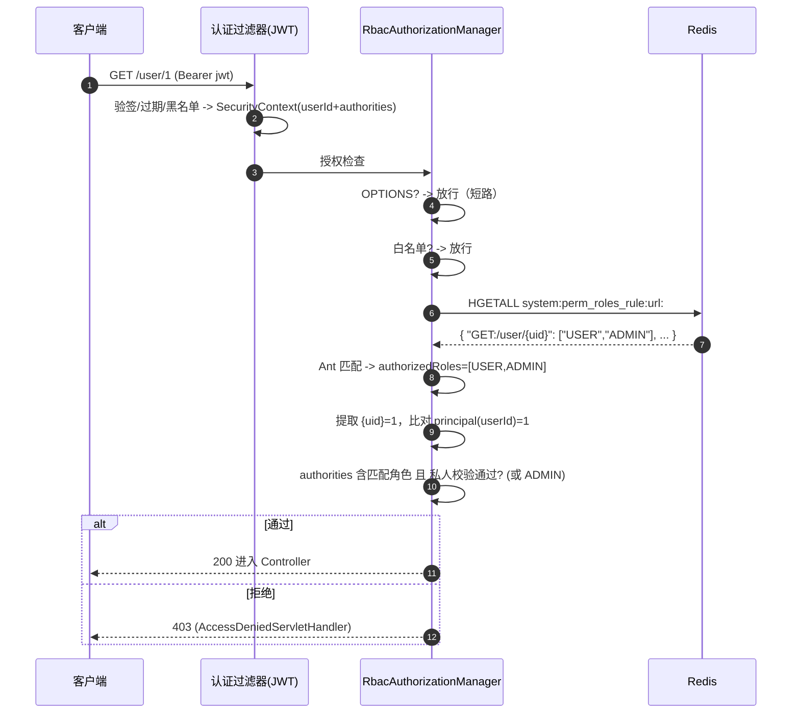

# RBAC 权限体系全流程

> 面向开发者：理清「角色-权限数据模型 -> 启动加载规则缓存 -> 请求鉴权判定 -> 角色变更生效」的完整链路。
> 关联代码集中在 `infrastructure/config/security/`、`domain/service/system/SysPermissionService.java`、`SysRoleService.java`、`infrastructure/config/InitPermissionRolesCache.java`。

## 1. 总览

本项目授权采用 **RBAC + URL 权限规则缓存** 模型：角色在登录/刷新时写入 JWT `authorities` claim（快照），URL 级「权限 -> 角色合集」规则缓存于 Redis Hash，请求时由 `RbacAuthorizationManager` 匹配判定。

与认证的关系：认证（JWT 校验、SecurityContext 填充）见 [login-lifecycle.md](./login-lifecycle.md) §5；本文档覆盖其后的**授权**环节。

```
sys_user ──< sys_user_role >── sys_role ──< sys_role_permission >── sys_permission(url_perm/btn_perm)
                                        │
                 启动时 InitPermissionRolesCache 刷新
                                        ▼
        Redis Hash: system:perm_roles_rule:url:  { "GET:/api/...": ["ADMIN","USER"], ... }
                                        │
        请求时 RbacAuthorizationManager 读取匹配 -> AuthorizationDecision
```

**重要事实（deny-by-default）**：`SecurityConfig` 对 `anyRequest()` 挂 `RbacAuthorizationManager`；一个路径若既不在白名单、也未在 `sys_permission.url_perm` 配置，则 `authorizedRoles` 为空 -> **403 拒绝**。新端点上线必须同步配置权限规则。

## 2. 数据模型（MySQL，eve_helper 库）

| 表 | 作用 | 关键列 |
|----|------|--------|
| `sys_user` | 用户 | id、username、password(BCrypt) |
| `sys_role` | 角色 | id、**code**（鉴权用的角色标识） |
| `sys_user_role` | 用户-角色绑定 | user_id、role_id |
| `sys_permission` | 权限点 | **url_perm**（如 `GET:/user/*`）、**btn_perm**（按钮权限，供前端） |
| `sys_role_permission` | 角色-权限绑定 | role_id、permission_id |

规则加载 SQL（`SysPermissionMapper.xml#listPermRoles`）：`sys_permission LEFT JOIN sys_role_permission LEFT JOIN sys_role`，产出 (url_perm -> [role.code])。

> ⚠️ **超级角色是 `ADMIN`**：`GlobalConstants.ROOT_ROLE_CODE = "ADMIN"` -- 常量名叫 ROOT，值是 `ADMIN`。数据库中 code=`ADMIN` 的角色即超管，直接放行一切（含私人资源校验）。

## 3. 规则缓存加载

- **触发**：① 容器启动（`InitPermissionRolesCache implements CommandLineRunner`）；② 手动调 `SysPermissionService.refreshPermRolesRules()`。
- **流程**（`refreshPermRolesRules`）：
  1. 删除旧缓存 `system:perm_roles_rule:url:` 与 `:btn:`。
  2. 查库 `listPermRoles()`。
  3. URL 规则写入 Redis Hash `system:perm_roles_rule:url:`（field=`url_perm`，value=角色 code 列表）。
  4. 按钮规则同理写 `system:perm_roles_rule:btn:`。
  5. `convertAndSend("cleanRoleLocalCache", "true")` 广播通知（清各节点本地缓存）。

> ⚠️ **`cleanRoleLocalCache` 频道主代码无订阅者** -- 是给前端/多实例本地缓存预留的广播，本服务未消费。规则变更后本服务侧直接读 Redis Hash，天然生效；但**用户侧角色变更不会即时生效**（见 §6）。

## 4. 请求鉴权（RbacAuthorizationManager）

每个非白名单请求（`anyRequest().access(authorizationManager)`）进入 `check()`：

1. **OPTIONS 预检短路**：直接放行。该短路**有意**不并入 `WhiteUrlMatcher` -- CORS 预检不带 Authorization 头，走过滤器「非 JWT 不处理」分支，两侧无需对齐（plan v3 §3.2）。
2. **白名单**：`WhiteUrlMatcher.isWhiteListed(request)`（单一事实来源，与 `JwtAuthorizationTokenFilter` 共同消费）命中即放行。
3. **构造 RESTful 权限键**：`restfulPath = method + ":" + requestURI`（如 `GET:/user/1`）。
4. **读规则**：`redisTemplate.opsForHash().entries("system:perm_roles_rule:url:")` 全量读 Hash。
5. **Ant 匹配**：遍历规则，`pathMatcher.match(perm, restfulPath)` 命中则收集其角色到 `authorizedRoles`（多条规则命中取合集）。
   - **私人资源校验**：若规则是含 `{uid}` 的模板（如 `GET:/user/{uid}`），提取实际 URI 中的 uid 与 `authentication.getPrincipal()`（即 JWT 的 userId claim）比对；不匹配则该请求的私人校验失败。
6. **判定**：`authentication.isAuthenticated()` 且用户 authorities 满足其一：
   - authority == `ADMIN`（超管直接放行）；
   - **同时满足**：authorities 含 `authorizedRoles` 中任一角色 **且** 私人资源校验通过。

### 4.1 请求鉴权时序图



## 5. 用户角色的加载时机（authorities 快照）

用户角色在两个时点从库中加载并写入 JWT `authorities` claim：

- **登录时**：`SysUserDetailsService.loadUserByUsername` -> `SysRoleService.queryRolesByUserId`（`sys_user_role` JOIN `sys_role` 取 code 列表）。
- **刷新时**：`AuthApplicationService.refreshToken` -> `queryRolesByUserId` 重载（见 login-lifecycle §7）。

请求鉴权时 `RbacAuthorizationManager` 读取的是 JWT claim 里的角色，**不查库** -- 这是性能取舍：角色变更后，用户需重新登录或等下一次 token 刷新才生效（最长 access TTL 900s + 主动刷新）。

## 6. 角色变更的生效链路与运维事实

| 变更 | 生效方式 | 时效 |
|------|----------|------|
| 修改 `sys_permission`（URL 规则） | 调 `refreshPermRolesRules()` 或重启 -> 重写 Redis Hash | 即时（所有请求读 Redis） |
| 修改 `sys_user_role`（用户角色） | 用户重新登录 / refresh token 轮换重载 | 最长延迟 = access TTL（15min） |
| 白名单变更 | 改 `application-*.yml` 的 `eve.helper.whiteUrlList` + 重启 | 重启后 |

运维提醒：直接改库不调 `refreshPermRolesRules()` 时，Redis 旧规则会一直生效到下次重启 -- **改权限表后必须手动刷新或重启**。

## 7. 设计要点与坑

| 要点 | 位置 | 说明 |
|------|------|------|
| deny-by-default | `SecurityConfig.anyRequest().access(...)` | 未配置权限的端点默认 403，新端点必须补规则 |
| 超管常量名值不一致 | `GlobalConstants.ROOT_ROLE_CODE="ADMIN"` | 读代码时勿被 ROOT 字面量误导 |
| OPTIONS 短路独立于白名单 | `RbacAuthorizationManager.check` | 有意设计，勿合并进 WhiteUrlMatcher |
| 白名单单一事实来源 | `WhiteUrlMatcher` | 过滤器与 RBAC 共同消费，防 401 死循环 |
| 私人资源校验依赖 principal=userId | `check` 中 `extractUriTemplateVariables` | 模板变量名必须是 `{uid}` 才触发 |
| authorities 是 JWT 快照 | §5 | 改角色不即时生效，需重新登录/刷新 |
| 规则全量读 Hash | `opsForHash().entries` | 每请求一次 Redis 读，规则量大时可评估本地缓存（`cleanRoleLocalCache` 频道已预留） |

## 8. 关键代码文件索引

| 环节 | 文件 |
|------|------|
| 鉴权管理器 | `infrastructure/config/security/RbacAuthorizationManager.java` |
| 安全过滤链装配 | `infrastructure/config/security/SecurityConfig.java` |
| 白名单匹配 | `infrastructure/config/security/WhiteUrlMatcher.java`、`EveHelperSecurityConfig.java` |
| 规则缓存加载（启动） | `infrastructure/config/InitPermissionRolesCache.java` |
| 规则缓存服务 | `domain/service/system/SysPermissionService.java` |
| 用户角色查询 | `domain/service/system/SysRoleService.java`、`infrastructure/persistence/repository/system/SysRoleRepositoryImpl.java` |
| 角色/权限 SQL | `src/main/resources/mappers/system/SysRoleMapper.xml`、`SysPermissionMapper.xml` |
| 常量（键名/超管） | `shared/kernel/constants/GlobalConstants.java` |
| 拒绝/入口处理 | `infrastructure/config/security/handler/AccessDeniedServletHandler.java`、`AuthenticationServletEntryPoint.java` |
